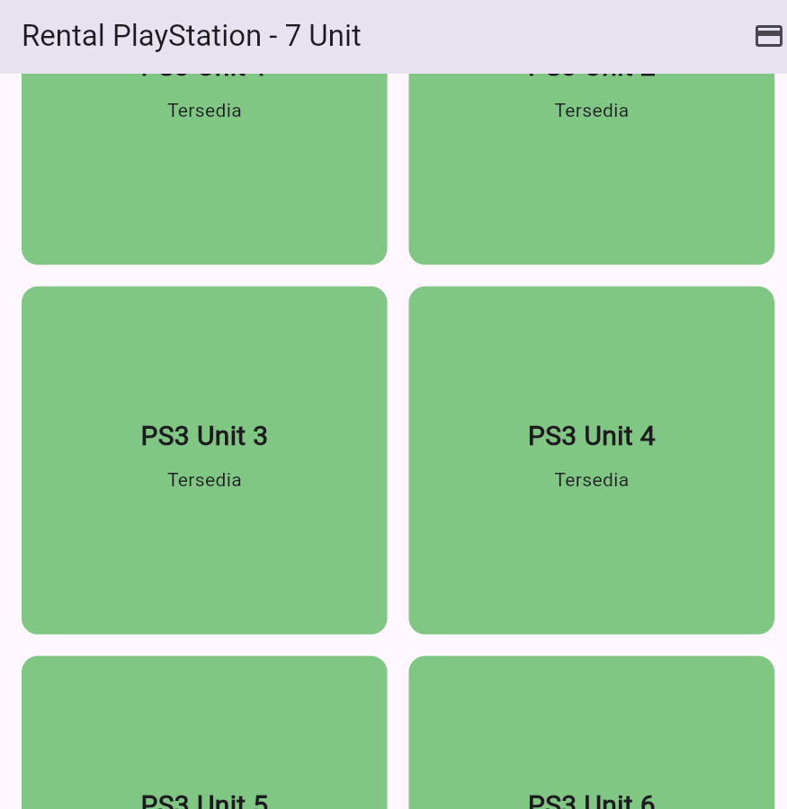
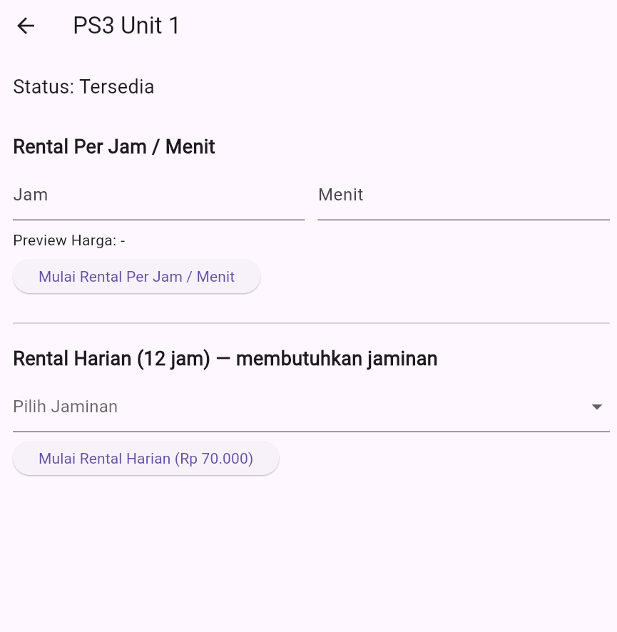

# 🎮 Flutter Billing PlayStation
[](https://flutter.dev)
[](LICENSE)

Aplikasi manajemen penagihan sederhana yang dibangun menggunakan **Flutter** untuk mencatat transaksi dan durasi penyewaan PlayStation.

## ✨ Fitur Utama
* **Pencatatan Transaksi:** Mencatat waktu mulai dan waktu selesai penyewaan.
* **Kalkulasi Otomatis:** Menghitung biaya berdasarkan durasi sewa.
* **Antarmuka Pengguna:** Desain yang intuitif dan mudah digunakan.

---

## 📸 Tampilan Aplikasi (Screenshots)

Berikut adalah beberapa tampilan utama dari aplikasi ini:

### Halaman Utama (Main Screen)


### Detail Transaksi (Transaction Details)


---

## 🛠️ Persiapan dan Instalasi

Untuk menjalankan aplikasi ini secara lokal, Anda perlu memastikan telah menginstal [Flutter SDK](https://flutter.dev/docs/get-started/install).

### 1. Kloning Repositori
```bash
git clone [https://github.com/wanleiraaaa/flutter_billing_playstation3.git](https://github.com/wanleiraaaa/flutter_billing_playstation3.git)
cd flutter_billing_playstation3
2. Dapatkan Dependencies
Bash

flutter pub get
3. Jalankan Aplikasi
Bash

flutter run
🧑‍💻 Kontribusi
Kontribusi dipersilakan! Aplikasi ini akan terus update, jika Anda memiliki saran atau ingin melaporkan bug, silakan buat Issue atau Pull Request.

📄 Lisensi
Proyek ini dilisensikan di bawah Lisensi MIT. Lihat file LICENSE untuk detail lebih lanjut.